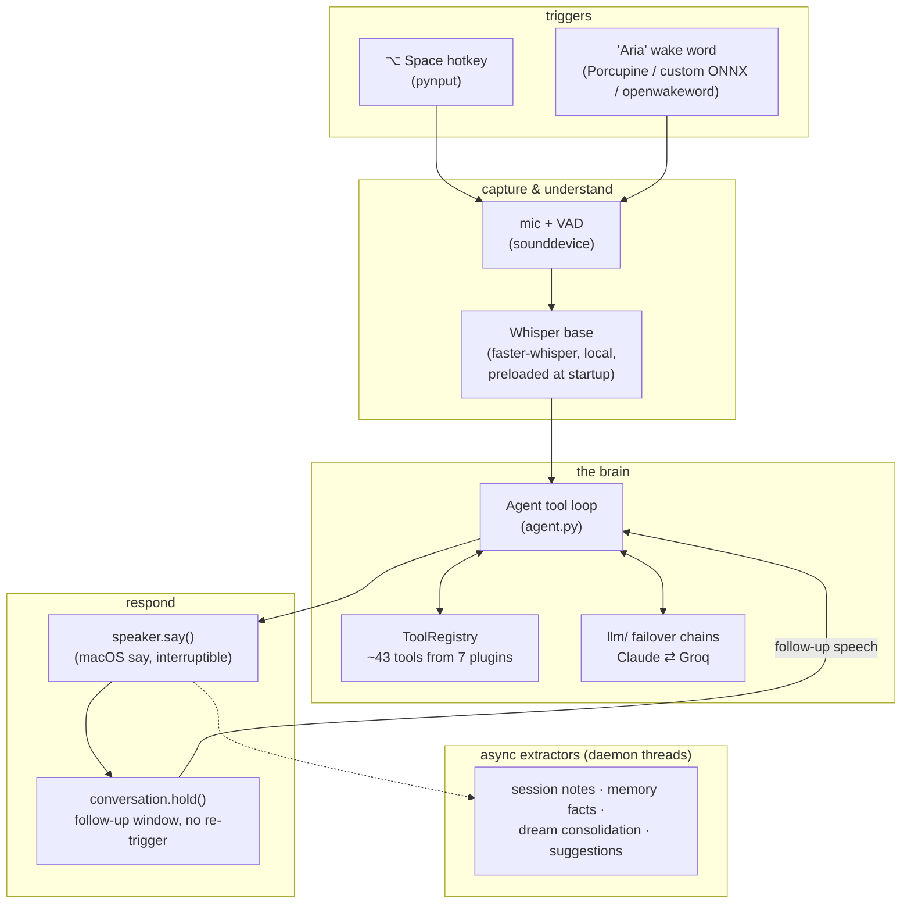
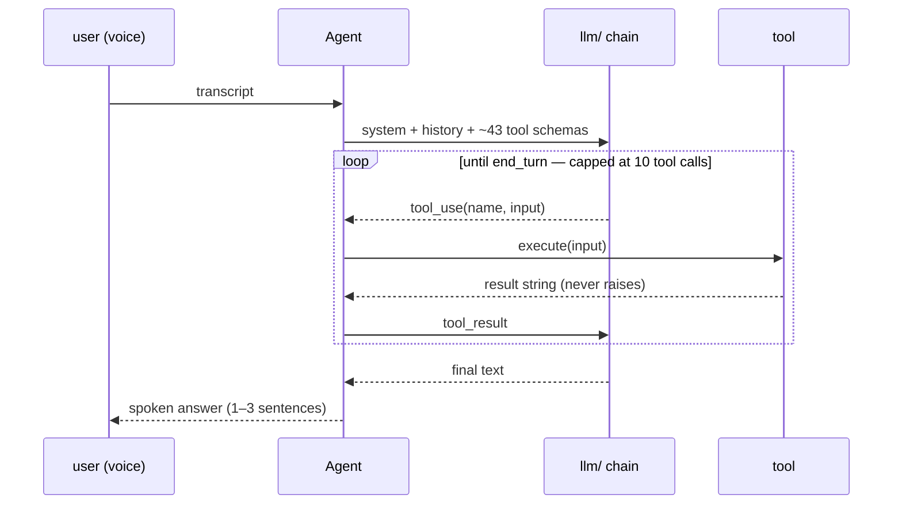
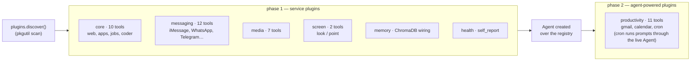
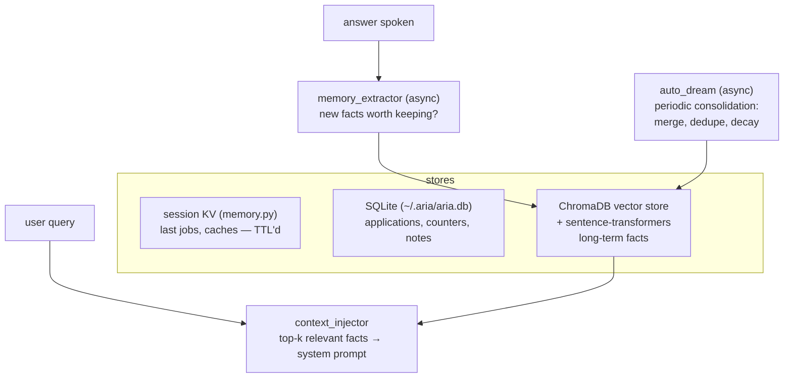
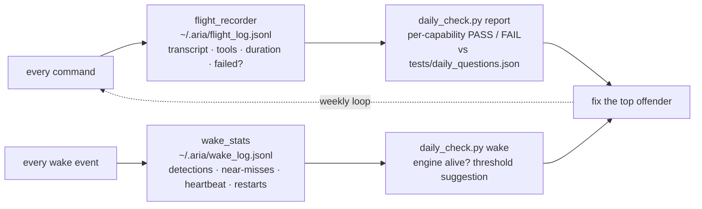

# Aria Architecture

Aria is a **background voice agent for macOS**: hotkey or wake word → speech → a
tool-using LLM agent → spoken answer. The screen never moves, the browser never
steals focus, and the whole loop runs while you keep working.

Three ideas shape everything below:

1. **One brain, many hands.** A single tool-loop Agent decides; ~43 tools across
   7 drop-in plugins act. There is no intent classifier, no routing table —
   deleted, on purpose (see [Design invariants](#design-invariants)).
2. **The user is never left guessing.** Every state Aria can be in is visible
   (menubar + on-screen HUD) or audible (chime, no-speech cue, "one moment").
3. **It measures itself.** Every command and every wake-word event is logged
   locally; a daily checklist turns those logs into a per-capability
   pass/fail report. Reliability work is driven by data, not vibes.

---

## The command lifecycle



A follow-up spoken into the `conversation.hold()` window goes straight back
into the Agent **with full cross-turn history** — "what about tomorrow?" just
works, no hotkey, no wake word.

## The Agent: one loop, no routing

`agent.py` is ~180 lines and is the only decision-maker. Each turn:



- **History compaction** keeps multi-turn sessions inside the context window.
- **Memory injection**: relevant facts from the vector store are prepended to
  the system prompt per query (`plugins/memory/context_injector.py`).
- **Failure discipline**: a tool that throws becomes a readable error string in
  the transcript; the model gets a chance to recover, and `Agent.run()` itself
  can never raise into the voice loop.

### LLM failover tiers (`llm/`)

Every completion names a tier, not a model. Each tier is a provider chain that
falls through on rate limits, auth errors, or outages:

| tier | chain | used for |
|---|---|---|
| `smart` | Claude Sonnet 4.6 → Claude Haiku 4.5 → Llama-3.3-70B (Groq) | the Agent loop |
| `cheap` | Claude Haiku 4.5 → Llama-3.3-70B | extractors, summaries |
| `fast` | Llama-3.3-70B → Claude Haiku 4.5 | latency-sensitive helpers |

One provider being down degrades quality, never availability.

## Plugins: drop a folder in, get capabilities

A plugin is a folder under `plugins/` whose `__init__.py` defines a
`PluginBase` subclass. **That's the entire contract.** `plugins.discover()`
finds it at startup — no imports to add, no registration list to edit, and a
broken plugin is skipped with a log line instead of taking Aria down.



A minimal plugin:

```python
# plugins/hue/__init__.py
from plugin import PluginBase
from tool import ToolDescriptor, ToolRegistry

class HuePlugin(PluginBase):
    def register(self, registry: ToolRegistry) -> None:
        registry.register(ToolDescriptor(
            name="lights_set",
            description="Set the room lights: on, off, or a brightness 0-100.",
            input_schema={"type": "object",
                          "properties": {"level": {"type": "string"}},
                          "required": ["level"]},
            execute=lambda p: _set_lights(p["level"]),
        ))
```

Restart Aria; the Agent can now control your lights. Plugins that need shared
services (browser, speaker, the Agent itself) override `from_context()` and
declare `requires_agent = True` to load in phase 2.

## Memory: four layers, one assistant that remembers



Tell Aria your favorite coffee once; it's embedded, consolidated during
"dreams," and injected into context whenever coffee comes up — this session or
next month.

## Feedback: nothing happens silently

| you experience | source |
|---|---|
| pulsing pill at screen bottom whenever the mic is open | `listening_indicator.py` (click-through, never takes focus) |
| Glass chime on wake, Basso thunk if it woke but heard nothing | `wake_word.py` |
| soft pop when the follow-up window opens, "Anytime." on thanks | `conversation.py` |
| "One moment." when a turn runs past 3.5 s | `speaker.ThinkingAck` |
| menubar ◉ → 🎙 → ⏳ → ✓ | `menubar.py` (rumps) |

## Observability: the assistant that files its own bug reports

Two local-only JSONL logs, one report tool:



- `daily_check.py list --core` — a ~3-minute spoken checklist covering every
  capability.
- `daily_check.py report` — matches the flight log against that checklist:
  what passed, what failed, what the mic actually heard, which tool broke.
- `daily_check.py wake` — is the wake engine alive, how many near-misses, and
  a data-driven threshold suggestion when misses outnumber hits.
- Ask Aria herself: *"how have you been performing?"* (health plugin reads the
  same log).

The wake-word listener runs under a supervisor loop: crashes restart with
exponential backoff and are logged — it cannot die silently.

## Design invariants

These are enforced, not aspirational:

1. **Never steal focus.** All Playwright work runs through a single worker
   thread (`agent_browser.run()` / `navigate()`); on-screen surfaces
   (`overlay.py`, `listening_indicator.py`) are borderless, click-through, and
   shown with `orderFrontRegardless`.
2. **Never raise into the voice loop.** Every handler returns a graceful
   spoken fallback. `Agent.run()`, `conversation.hold()`, both loggers, and
   every plugin tool are exception-proof at their boundary.
3. **One brain.** The intent classifier / planner stack (~2,100 lines) was
   deleted once the tool-loop Agent proved strictly better. Dead paths drift;
   drift ships bugs.
4. **Local-first.** Whisper, wake models, ChromaDB, both logs — all on-device.
   Only LLM completions leave the machine.
5. **Voice is the UI.** Answers are 1–3 spoken sentences; no markdown, no URL
   dumps. Long work is acknowledged out loud rather than silently spinning.
6. **Python 3.9 discipline.** `from __future__ import annotations` everywhere;
   no `str | None` at runtime.

## Repository map

```
main.py                 wiring + command lifecycle (the only god allowed)
agent.py                the tool loop
tool.py                 ToolDescriptor / ToolRegistry
plugin.py               PluginBase + PluginContext (the plugin contract)
plugins/                drop-in capability packs (core, media, messaging,
                        memory, productivity, screen, health)
llm/                    provider chains: Anthropic + Groq, tiered failover
conversation.py         follow-up window (the "Jarvis feel")
speaker.py              interruptible TTS + ThinkingAck
wake_word.py            3-backend wake engine under a restart supervisor
listening_indicator.py  on-screen listening HUD
transcriber.py / voice_capture.py / hotkey.py / menubar.py
memory.py / memory_extractor.py / auto_dream.py     memory layers
flight_recorder.py / wake_stats.py / daily_check.py observability
screen_qa.py / selection.py / overlay.py / vision.py screen intelligence
browser.py / agent_browser.py / computer_use.py      background browsing
training/               custom wake-word model pipeline (record → train → onnx)
tests/                  448 passing; tests/daily_questions.json drives the
                        daily voice checklist
```

## Testing strategy

- **Unit**: pure logic (VAD thresholds, end-phrase detection, report building,
  discovery ordering) — fast, no hardware.
- **Contract**: every tool returns a string and never raises; plugins load
  from a bare `PluginContext`.
- **On-device**: `tests/checklist.md` + the daily voice checklist exercise the
  real mic, TTS, screen permissions, and focus behavior — the things mocks
  can't prove.
- **Continuous**: normal daily use *is* the test run; the flight recorder
  scores it and `daily_check.py report` grades it.
