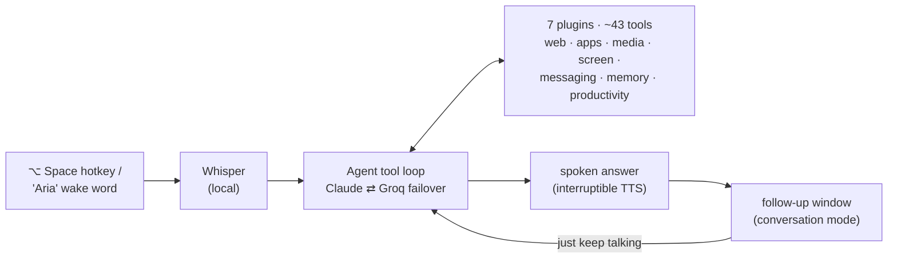

# Aria — a background voice agent for macOS

Hold a hotkey (or say *"Aria"*), speak, and get a spoken answer — while the
screen never moves and the browser never steals focus. A local-first,
Jarvis-style assistant that stays out of your way.

```
you:   "Aria, what's the weather right now?"
aria:  "It's 78 and sunny in Buffalo."          ← spoken, screen untouched
you:   "what about tomorrow?"                    ← no hotkey, mic re-opened itself
aria:  "Tomorrow looks like 81 with afternoon storms."
you:   "thanks"
aria:  "Anytime."
```

## How it works

One tool-loop LLM agent, ~43 tools across 7 drop-in plugins, and a feedback
layer that makes every state visible or audible:



Full design — agent loop, plugin contract, memory layers, observability —
with diagrams: **[ARCHITECTURE.md](ARCHITECTURE.md)**.

## What it can do

| | |
|---|---|
| **Converse** | follow-ups without re-triggering; cross-turn memory; "one moment" when thinking |
| **See your screen** | "what's on my screen?" · "show me where the save button is" (draws on screen) |
| **Browse in the background** | multi-step research, price comparisons — headless, never steals focus |
| **Control your Mac** | open apps, media playback, volume/brightness, screenshots |
| **Message people** | iMessage, WhatsApp, Telegram, Discord, Slack — always confirms before sending |
| **Run your day** | morning briefing, Gmail, Calendar, voice reminders via cron |
| **Job hunt** | searches LinkedIn + Indeed, tracks applications, helps fill forms |
| **Remember** | vector memory with periodic "dream" consolidation — tell it once |
| **Write code** | agentic coding tasks by voice |
| **Report on itself** | "how have you been performing?" — reads its own flight log |

## Reliability, measured

Aria logs every command and every wake-word event locally, then grades itself:

```bash
venv/bin/python daily_check.py list --core   # ~3-min spoken checklist
venv/bin/python daily_check.py report        # per-capability PASS / FAIL
venv/bin/python daily_check.py wake          # wake engine alive? threshold tips
```

The wake listener runs under a restart supervisor and writes a heartbeat —
it can't die silently. Details in
[ARCHITECTURE.md → Observability](ARCHITECTURE.md#observability-the-assistant-that-files-its-own-bug-reports).

## Setup

Requires macOS, [Homebrew](https://brew.sh), Python 3.9+, and
`brew install ffmpeg`.

```bash
git clone https://github.com/Bhanu1299/Aria.git
cd Aria

python3 -m venv venv
source venv/bin/activate
pip install -r requirements.txt
playwright install chromium

cp .env.example .env   # add GROQ_API_KEY and ANTHROPIC_API_KEY
```

**Permissions** (System Settings → Privacy & Security), then restart your
terminal:

- **Microphone** — add your terminal app
- **Accessibility** — add your terminal app (hotkey + app control)
- **Screen Recording** — add your terminal app (screen questions, optional)

## Run

```bash
source venv/bin/activate
python main.py
```

Aria starts silently as a menu bar icon: ◉ idle → 🎙 listening → ⏳ thinking →
✓ done. Hold **⌥ Space**, speak, release — or just say **"Aria"**. A pulsing
pill at the bottom of the screen shows whenever the mic is open.

One-time logins for authenticated browsing:

```bash
python main.py --login gmail      # also: google, linkedin
```

## Stack

| layer | tech |
|---|---|
| transcription | faster-whisper (base), fully local |
| wake word | Porcupine / custom-trained ONNX / openwakeword — auto-selected |
| LLM | tiered failover: Claude Sonnet 4.6 → Haiku 4.5 → Llama-3.3-70B (Groq) |
| browser | Playwright + Chromium, single worker thread, headless |
| memory | ChromaDB + sentence-transformers, SQLite, session KV |
| voice I/O | sounddevice · macOS `say` (interruptible) |
| UI | rumps menu bar · AppKit overlays (click-through, never focused) |

## Extending

Drop a folder into `plugins/` with a `PluginBase` subclass — Aria discovers
and loads it at startup. No core edits. The 20-line example is in
[ARCHITECTURE.md → Plugins](ARCHITECTURE.md#plugins-drop-a-folder-in-get-capabilities).

## Troubleshooting

See [HOW_TO_RUN.md](HOW_TO_RUN.md) — hotkey not responding, microphone
errors, auth problems.

## License

MIT
